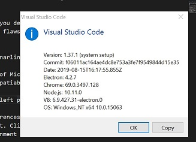
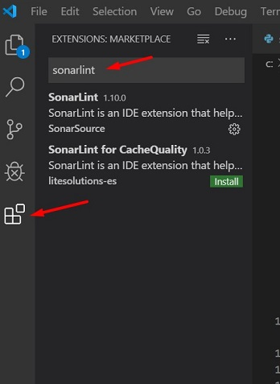
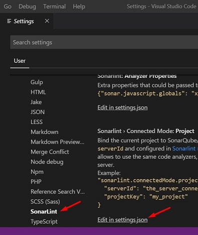
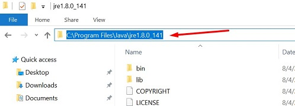
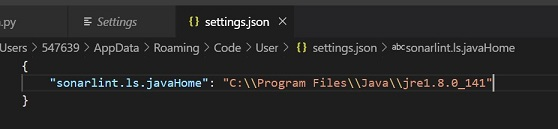
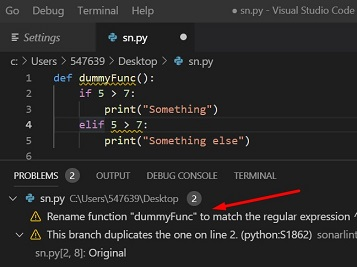

# SonarLint for VS Code configuration

SonarLint is an IDE extension that helps you detect and fix quality issues as you write code. Like a spell checker, SonarLint squiggles flaws so that they can be fixed before committing code.

List of steps to install and configure sonarlint in VS Code:

1. Make sure you have the latest version of Microsoft Visual Studio Code (VS Code) installed in your system as older versions have compatiblity issues. Latest version as of 30 Aug, 2019 is 1.37.1.
   
   

2. Click on the icon "Extensions" in the left pane of VS Code. Search for Sonarlint. Click on the button install.
   
   

3. After installation, go to File > Preferences > Settings > Extensions > Sonarlint and you'll find example settings related to Sonarlint. Click edit in settings.json.
   
   

4. Locate the path of Java Runtime Environment (jre) on your system. Usually it will look like the following.
   
   

5. Create an entry in settings.json as shown.
   
   

6. You can now use Sonarlint to track bugs, issues in your code.
   
   

